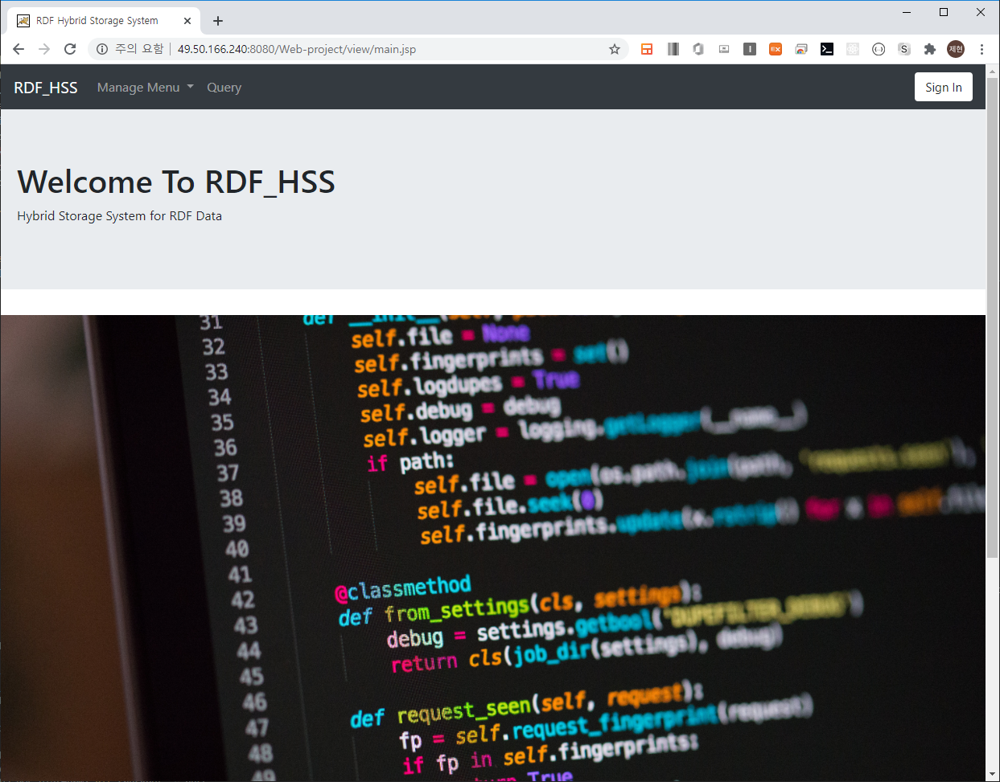
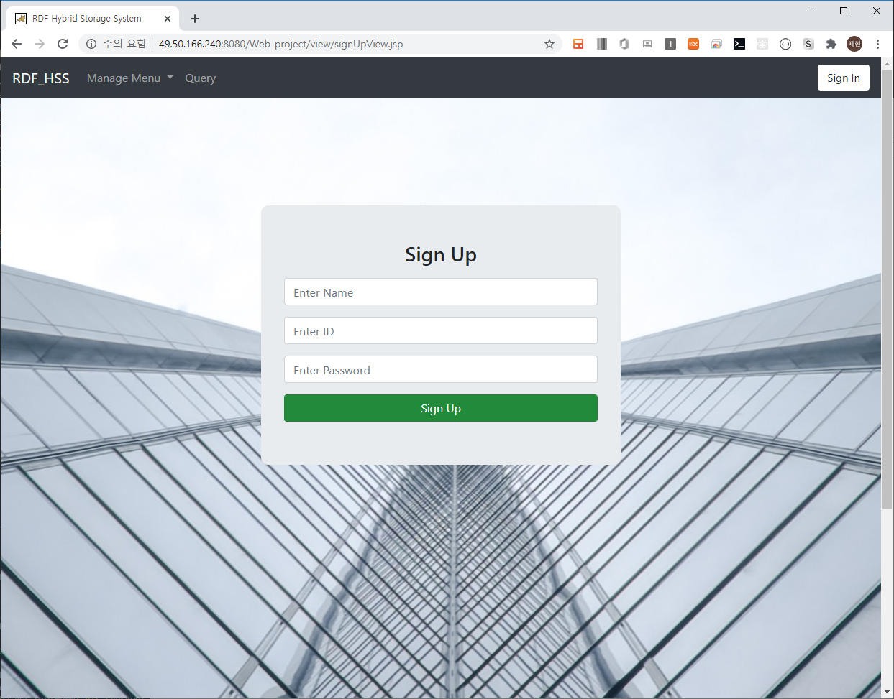
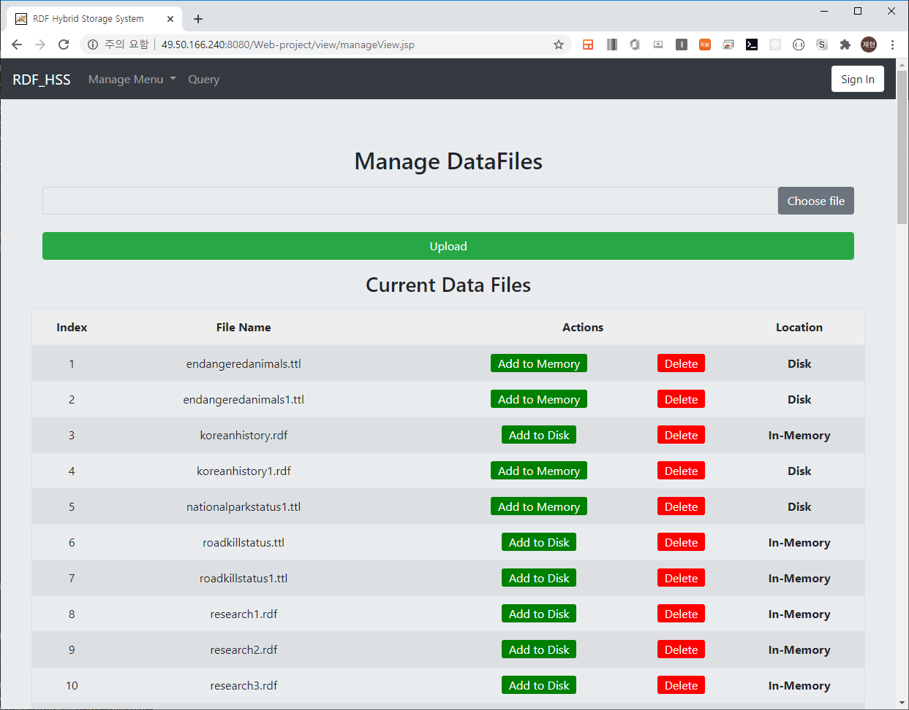
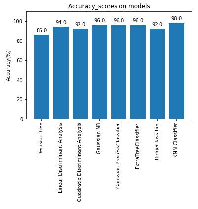
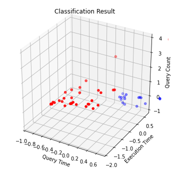
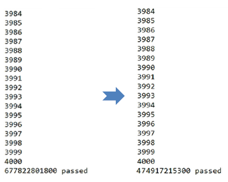

# CDP2_RDF_Platform

## Description
본 프로젝트는 RDF data에 대한 최적화된 질의 기능을 제공해주는 Data Platform 이다. Apache jena library을 기반으로 Memory와 SSD을 결합한 Hybrid Storage 구조를 통해 빠른 질의 처리 서비스를 제공한다.

## Collaborators
- 정제현 [JehyunJung](https://github.com/JehyunJung/) jhyun9152@naver.com
- 우정민 [Jeongmin Woo](https://github.com/greenblues1190/) - jeongmoon94@gmail.com
- 이인섭 [dldlstjq](https://github.com/dldlstjq/) - inseob111@naver.com
- 이승진 [Leeseungjin](https://github.com/Leeseungjin1/) - leetmdwls@naver.com

## Motivation
- Hybrid Storage System
    - SSD와 같은 flash memory의 경우 기존의 HDD와 같은 magnetic disk 방식의 data storage system에 비해서 높은 I/O 성능을 보여준다. 이는, HDD의 기계적인 회전을 통한 sequential search 방식을 전기적인 신호 방식을 활용한 random access 방식으로 대체하면서 생겨난 결과이다.
    - 하지만, 이러한 flash memory 또한 결점이 있는데, 바로 Update-Out-Place 방식의 쓰기연산을 진행한다는 것이다. 기존의 영역에 덮어쓰는 형태인 Update-In-Place 구조와는 달리, 데이터를 쓰기 연산을 진행함에 있어, 블록 단위의 포맷을 한 후, 메모리에 데이터를 쓸 수 있다.
    - flash memory의 느린 쓰기 연산을 개선 시킨 것이 바로, 3DXPoint와 같은 NVM(Non Volatile Memory)이다. 매우 빠른 I/O 처리속도를 보여주며, 데이터 단위가 적은 연산을 batch execution 할때 뛰어난 성능을 보여준다. 하지만, 이러한 NVM 메모리는 용량 대비 가격이 비싸기 때문에 비교적 가격이 싼 flash memory와 결합해서 **Hybrid Storage** 형태를 구성해서 이용한다.
- Hot Cold Data Clustering
    - 특정 데이터에 있어서 자주 접근(이용)되는 데이터가 있는데, 이를 **Hot Data**, 상대적으로 덜 이용되는 데이터는 **Cold Data**라고 한다.
    - Hybrid Storage System에서 데이터를 효율적으로 저장하기 위해, Hot Data의 경우 빠른 I/O 가능한 NVM 메모리에, Cold Data는 비교적 느린 flash memory에 저장하므로써 Hot Data에 대한 질의를 빠르게 처리할 수 있다. 이를 통해, NVM 메모리에 준하는 성능과 flash memory의 용량을 활용할 수 있다.

## Contents 
- Web application
    - Interface for user
- Hybrid Storage Server
- API codes for fuseki-server access
    - connect
    - update, delete, switch data type


## Developtment Environment
- jdk version >= 1.8
- apache tomcat 9.0
- mysql 5.7.30
- Anaconda 
- Clustering-related libraries
    - Matplotlib
    - scikit-learn
    - pandas
    - numpy

## Web Page info
### Main Page

 

#### Sign In 버튼을 클릭하게 되면 로그인 창으로 넘어가게 된다.

### Signin page

 

#### 아이디와 패스워드 입력을 통해 로그인이 가능하다
#### Sign Up 버튼을 클릭하게 되면 회원가입 창으로 넘어간다.

### Signup page

 

#### 이름, 아이디, 패스워드를 입력하고 Sign Up 버튼 클릭을 통해 회원가입이 가능하다.

### Data manage page

 

#### RDF Dataset을 관리하는 화면이다.
기능
- 파일 업로드
- 메모리/디스크 추가 
- 파일 삭제 기능

## Maching Learning

### Models

```python
Classifiers=[
    DecisionTreeClassifier(),
    LinearDiscriminantAnalysis(),
    QuadraticDiscriminantAnalysis(),
    GaussianNB(),
    GaussianProcessClassifier(kernel=1.0*RBF(1.0)),
    ExtraTreesClassifier(),
    RidgeClassifier(),
    KNeighborsClassifier(n_neighbors = 5)
]
```

### Results

#### Acccuracy

 

최대 98%의 정확도로 Hot/Cold Dataset을 분류하는 모델을 이용해서 Classification을 진행한다.

#### Classification Results

 

Hot은 빨간색으로, Cold는 파란색으로 표현하도록해서 Classification을 수행한 결과 위와 같이 Hot/Cold가 분류 것을 확인할 수 있다.

#### Query Execution Speed Enhancements

 

약 30%의 쿼리 수행 속도 증가를 확인할 수 있습니다.

## Results
- 논문: [하이브리드 스토리지 구조를 활용한 질의 성능 향상 기법](https://www.eiric.or.kr/literature/ser_view.php?grp_gu=INME&f1=DS&gu=INME020E0&q1_yy=2020&q1_mm=05&rn=10&q1_vol=21&q1_no=01&cmd=qryview&SnxIndxNum=232927&rownum=1&totalCnt=11&pg=1&kci=)

 
